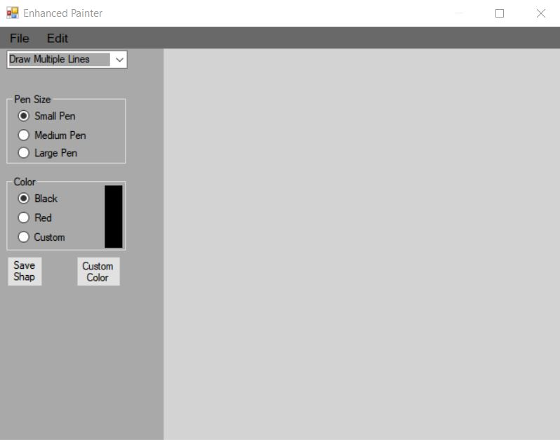
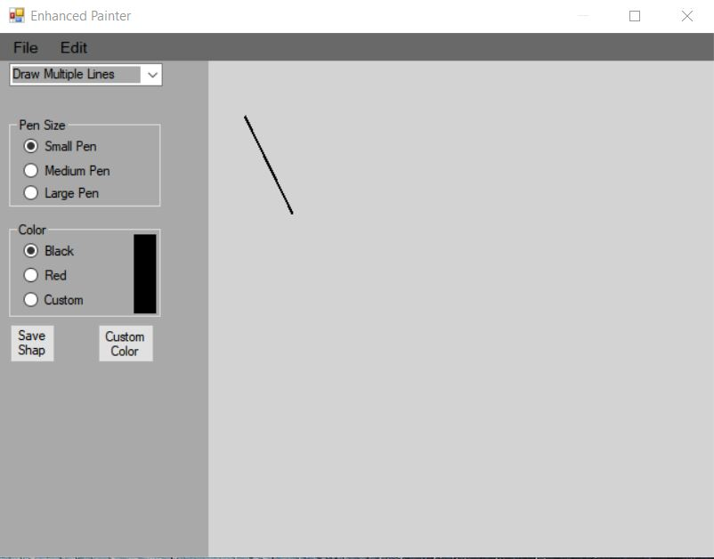
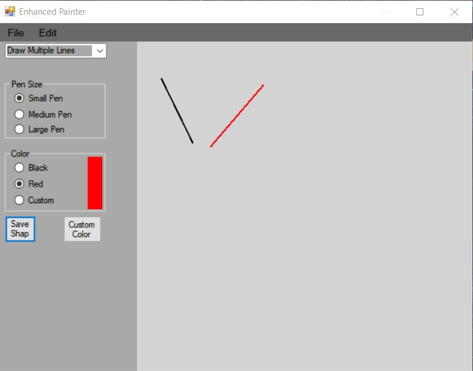
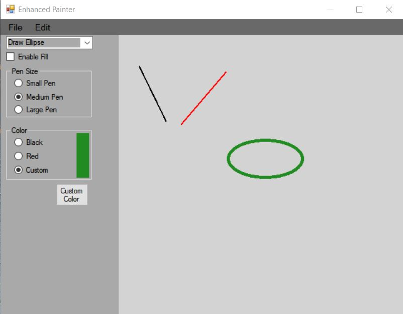
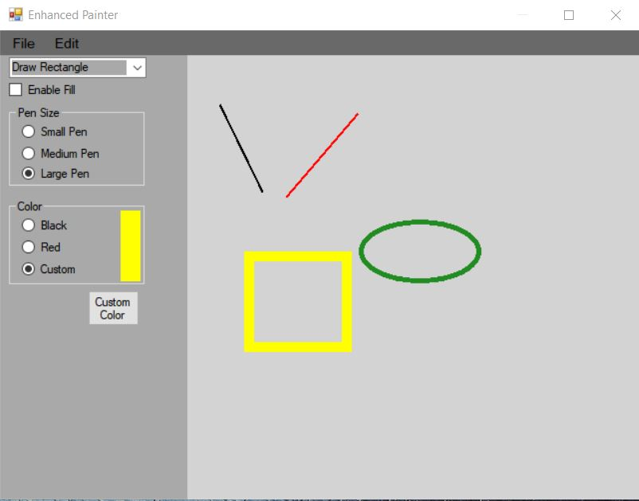
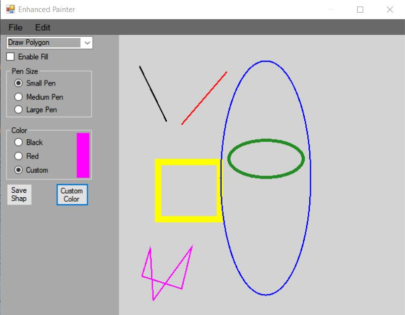
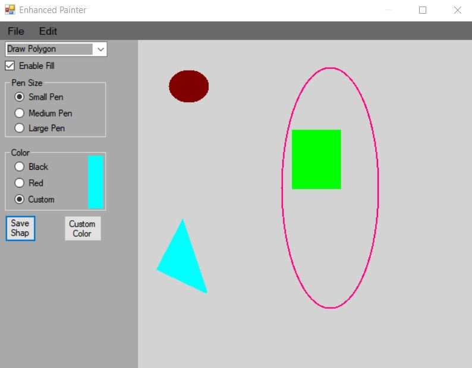

# Enhanced Painter
 
PURPOSE:  
To use radio buttons and mouse event handlers, menus, combo box and graphics concepts.      
PROBLEM: Drawing Tool  
Your task is to develop a graphics program to display lines, rectangles and ovals using 
methods from Graphics. The shape draw is selected from a combo box with check boxes. 
Your program should set up a drawing area with a size of at least 640x480.    

Create a GUI called Enhanced Painter.  
However, you will not be painting, you will be using graphics methods to draw or 
fill. Use variables to keep track of the currently selected size (int) of the “lines” of the 
drawn shapes and color (Color object). Change the values of those variables in the event 
handlers for the radio buttons. Use one event handler for each group of radio buttons.  

Use the mouse to determine the locations of the lines’ endpoints or corner points of the 
bounding box of the shapes.  

 
 
 
 
 
 
 
